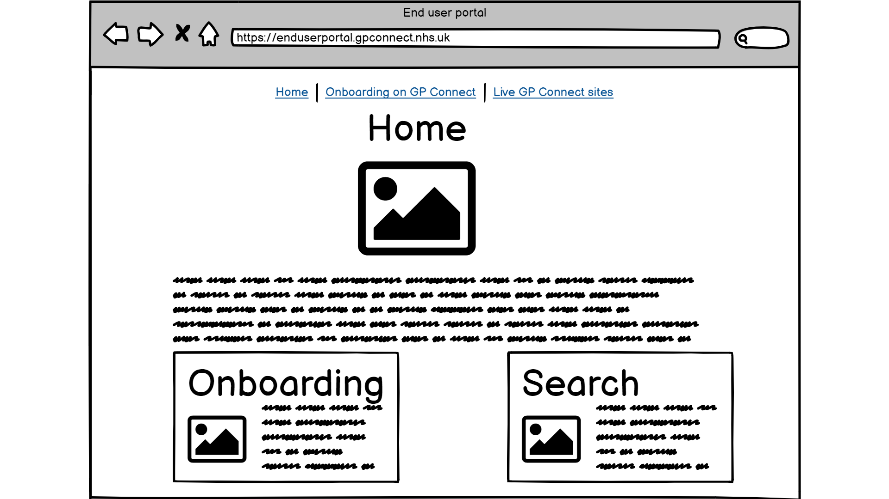
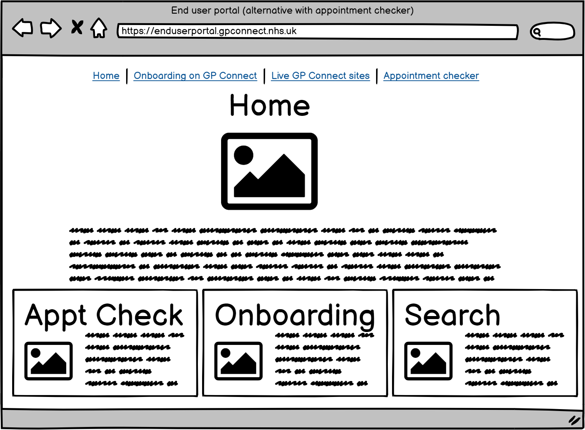
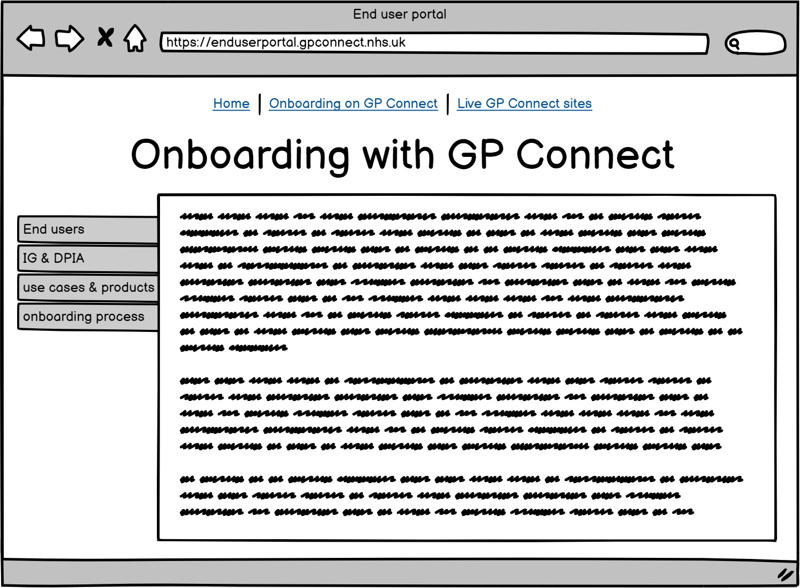
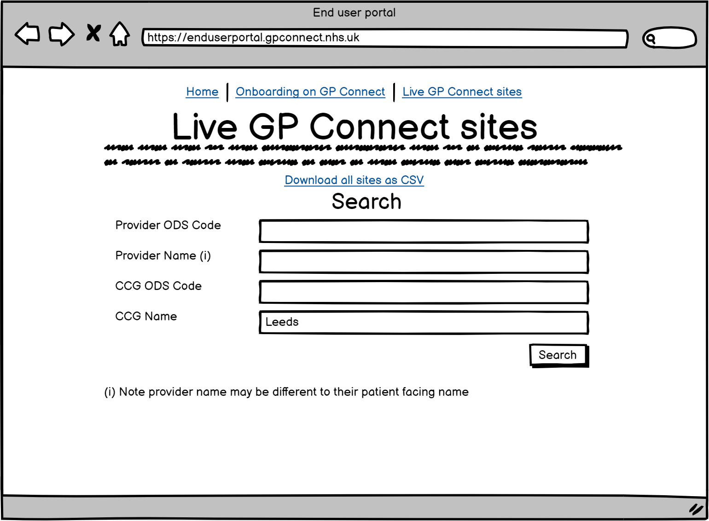
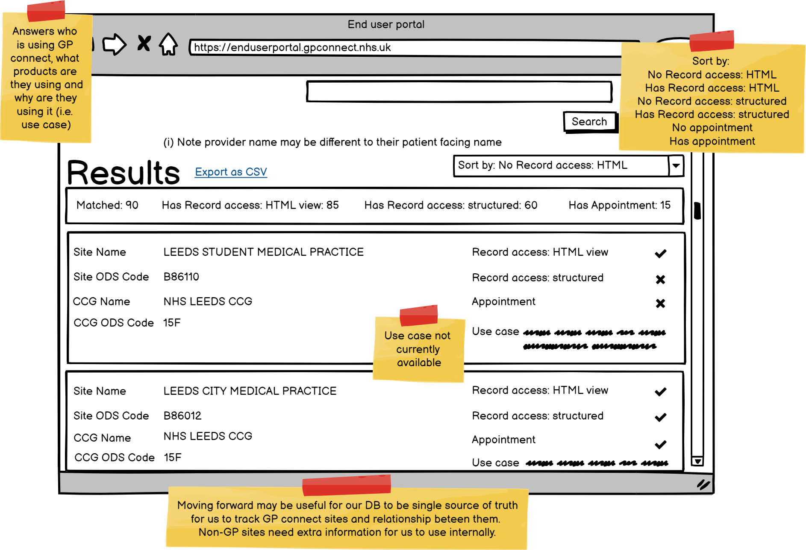

# GP Connect End User Portal

The GP Connect End User Portal is a web application.

## Tech stack

- C# / .NET 5.0
- ASP.NET
- Docker
- NHS UK frontend

## User screens











## Build status

[](https://github.com/nhsconnect/gpconnect-user-portal/actions)

## Build and run

Build and run the docker application image as follows, replacing the DB_ variables with the source database connection details:

```
cd source
docker build -t gpconnect-user-portal-application .
docker run -d -p 8000:80 -e "ConnectionStrings:DefaultConnection=Server=DB_HOST;Port=DB_PORT;Database=DB_DBNAME;User Id=DB_USERID;Password=DB_PASS" --name gpconnect-user-portal-application gpconnect-user-portal-application
```

To run over HTTPS replace the last command above with the following, replacing the DB_ variables with the source database connection details, and supplying the path to PFX file via the command line:

```
docker run -d -p 5001:443 -e ASPNETCORE_URLS="https://+" -e ASPNETCORE_HTTPS_PORT=5001 -e ASPNETCORE_Kestrel__Certificates__Default__Path=/certs/localhost.pfx -e "ConnectionStrings:DefaultConnection=Server=DB_HOST;Port=DB_PORT;Database=DB_DBNAME;User Id=DB_USERID;Password=DB_PASS" -v /path/to/certs:/certs --name gpconnect-user-portal-application gpconnect-user-portal-application
```

## Links

- [NHS UK frontend](https://github.com/nhsuk/nhsuk-frontend)
- [GOV.UK service manual - technology](https://www.gov.uk/service-manual/technology)

 
